<div align="center">
  
  
  **✨ 强大的代理订阅管理与转换工具 ✨**

  <p>
    
    
    
    
  </p>
  <p>
    
    
  </p>
  <p>
    
    
    
  </p>
  <p>
    
    
    
    
  </p>
  <p>
    <a href="https://github.com/ZeroDeng01/sublinkPro/issues">
      
    </a>
    <a href="https://github.com/ZeroDeng01/sublinkPro/releases">
      
    </a>
  </p>
</div>

---

## 📖 项目简介

`SublinkPro` 是基于优秀的开源项目 [sublinkX](https://github.com/gooaclok819/sublinkX) / [sublinkE](https://github.com/eun1e/sublinkE) 进行二次开发，在原项目基础上做了部分定制优化。感谢原作者的付出与贡献。

- 🎨 **前端框架**：基于 [Berry Free React Material UI Admin Template](https://github.com/codedthemes/berry-free-react-admin-template)
- ⚡ **后端技术**：Go + Gin + Gorm
- 🔐 **默认账号**：`admin` / `123456`（请安装后务必修改）
- 💻 **演示系统**: [https://sublink-pro-demo.zeabur.app](https://sublink-pro-demo.zeabur.app/) 用户名：admin 密码：123456

> [!WARNING]
> ⚠️ 本项目和原项目数据库不兼容，请不要混用。
>
> ⚠️ 请不要使用本项目以及任何本项目的衍生项目进行违反您以及您所服务用户的所在地法律法规的活动。本项目仅供个人开发和学习交流使用。

---

## ✨ 功能亮点

| 功能 | 说明 | 详情 |
|:---|:---|:---:|
| 🏷️ **智能标签系统** | 自动规则打标签、零代码筛选、标签互斥组 | [📖](docs/features/tags.md) |
| ⚡ **专业测速系统** | 双阶段测试、智能延迟测量、自动状态标记 | [📖](docs/features/speedtest.md) |
| 🔗 **链式代理** | Dialer-Proxy 原生支持、可视化配置、拯救被墙节点 | [📖](docs/features/chain-proxy.md) |
| ✈️ **机场管理** | 多格式导入、定时更新、流量监控 | [📖](docs/features/airport.md) |
| 📋 **订阅分享** | 多链接管理、过期策略、访问统计 | [📖](docs/features/subscription-share.md) |
| 🌐 **Host 管理** | 域名映射、DNS 配置、CDN 优选 | [📖](docs/features/host.md) |
| 🤖 **Telegram Bot** | 远程测速、订阅管理、系统监控 | [📖](docs/features/telegram-bot.md) |
| 📜 **脚本系统** | 节点过滤、内容后处理、多脚本链式执行 | [📖](docs/script_support.md) |
| 🔔 **Webhooks** | 支持 PushDeer、Bark、钉钉、方糖等多平台通知 | - |
| 🔐 **安全特性** | Token 授权、API Key、IP 黑/白名单、访问日志 | - |

---

## 🚀 快速开始

### Docker Compose（推荐）

创建 `docker-compose.yml`：

```yaml
services:
  sublinkpro:
    image: yzcczdyh/sublink-pro
    container_name: sublinkpro
    ports:
      - "8000:8000"
    volumes:
      - "./db:/app/db"
      - "./template:/app/template"
      - "./logs:/app/logs"
    restart: unless-stopped
```

启动服务：

```bash
docker-compose up -d
```

访问 `http://localhost:8000`，使用默认账号 `admin` / `123456` 登录。

> [!TIP]
> 更多安装方式（Docker、一键脚本、更新升级等）请参阅 [📦 安装部署指南](docs/installation.md)

---

## 📖 文档导航

### 🔧 安装与配置

| 文档 | 说明 |
|:---|:---|
| [📦 安装部署](docs/installation.md) | Docker、一键脚本、更新升级、Watchtower 自动更新 |
| [⚙️ 配置说明](docs/configuration.md) | 环境变量、命令行参数、验证码配置 |

### ✨ 功能详解

| 文档 | 说明 |
|:---|:---|
| [🏷️ 智能标签系统](docs/features/tags.md) | 自动规则打标签、零代码筛选、标签互斥组 |
| [⚡ 测速系统](docs/features/speedtest.md) | 测速原理、参数配置、流量计算 |
| [🔗 链式代理](docs/features/chain-proxy.md) | Dialer-Proxy、使用场景、配置流程 |
| [✈️ 机场管理](docs/features/airport.md) | 订阅导入、定时更新、流量监控 |
| [📋 订阅分享](docs/features/subscription-share.md) | 多链接管理、过期策略、访问统计 |
| [🌐 Host 管理](docs/features/host.md) | 域名映射、DNS 配置、测速持久化 |
| [🤖 Telegram 机器人](docs/features/telegram-bot.md) | 命令列表、配置指南 |
| [📜 脚本功能](docs/script_support.md) | 节点过滤、内容后处理、函数参考 |

### 👨‍💻 开发者

| 文档 | 说明 |
|:---|:---|
| [🛠️ 开发指南](docs/development.md) | 项目结构、本地开发、定时任务开发 |

---

## 📡 多协议支持

| 客户端 | 支持协议 |
|:---|:---|
| **v2ray** | base64 通用格式 |
| **clash** | ss, ssr, trojan, vmess, vless, hy, hy2, tuic, AnyTLS, Socks5 |
| **surge** | ss, trojan, vmess, hy2, tuic |

---

## 🖼️ 项目预览

<details open>
<summary><b>点击展开/收起预览图</b></summary>

| | |
|:---:|:---:|
| 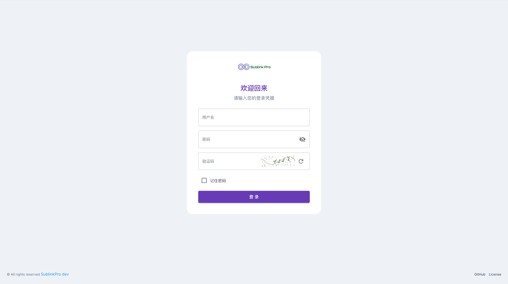 | 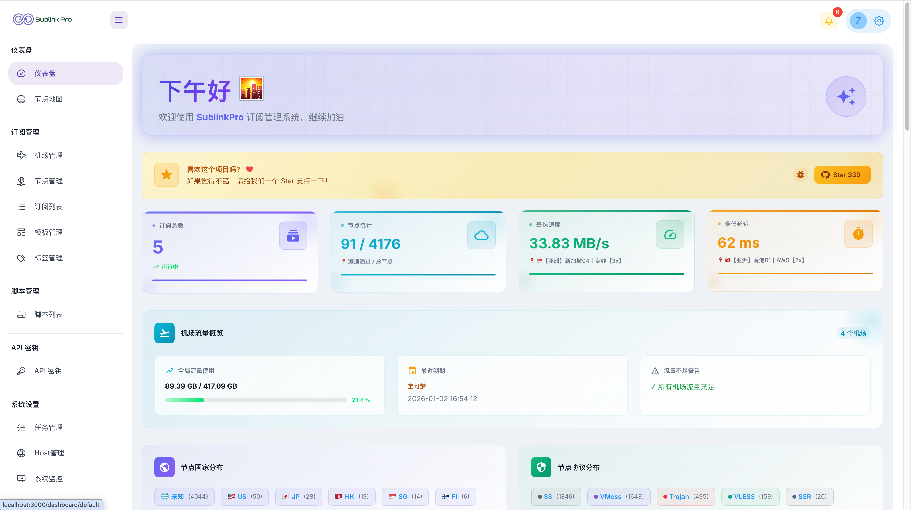 |
| 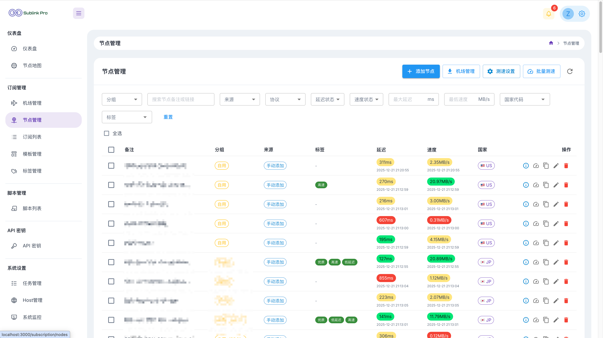 | 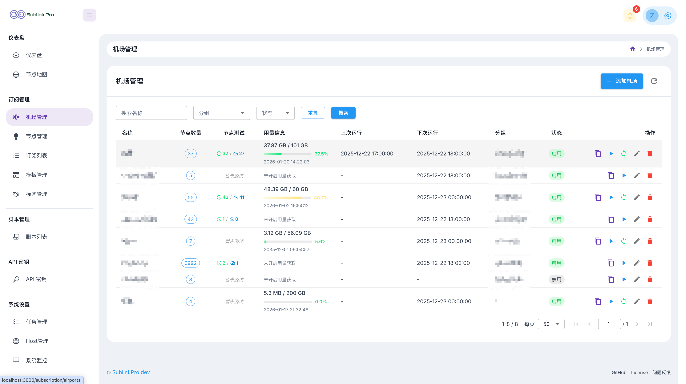 |
| 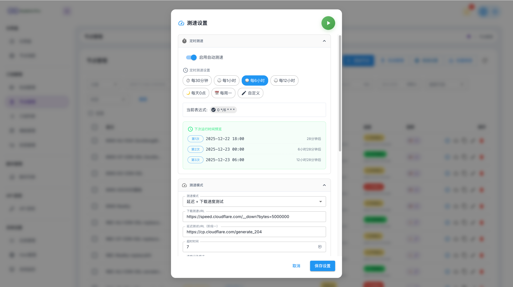 | 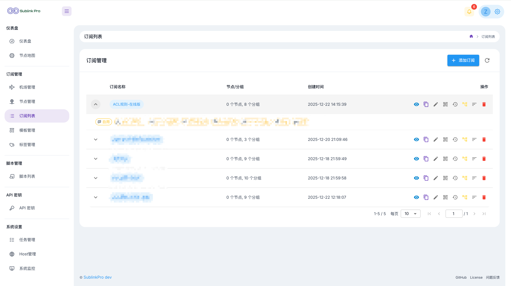 |
| 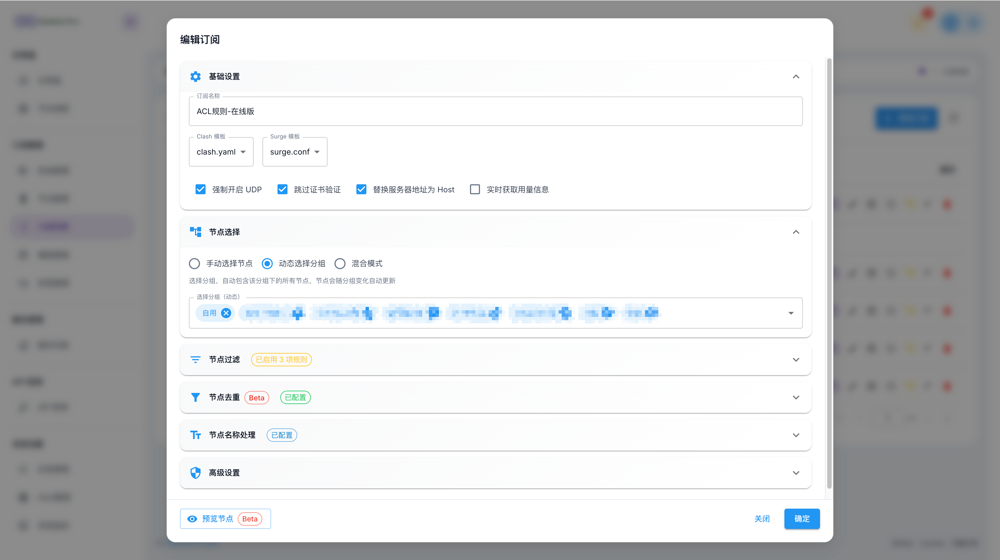 | 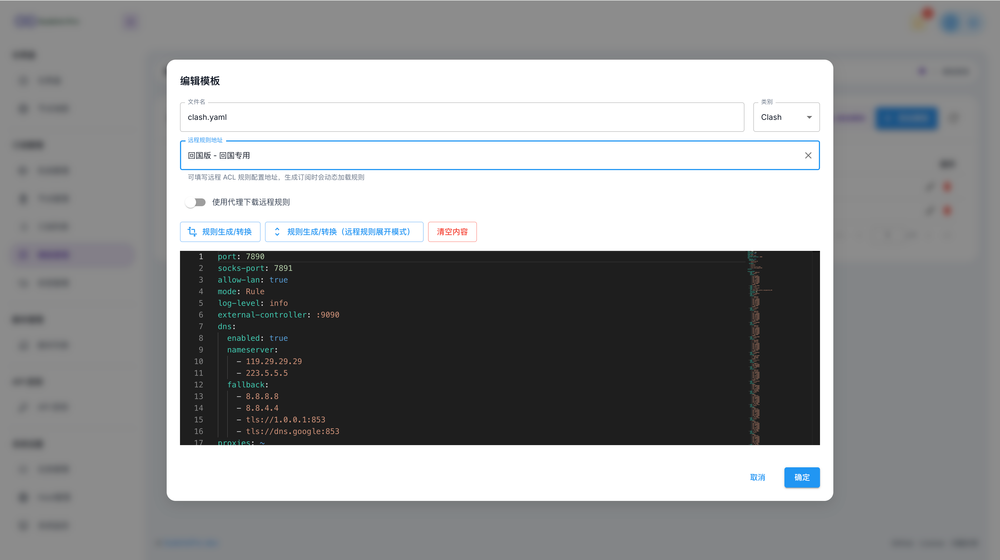 |
| 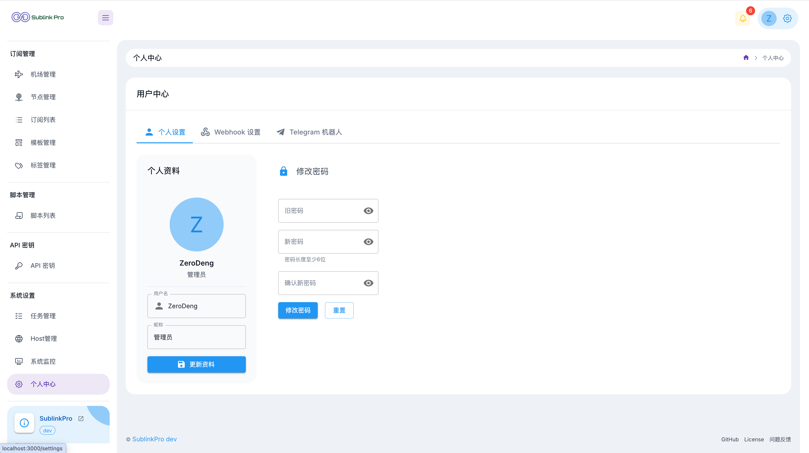 | 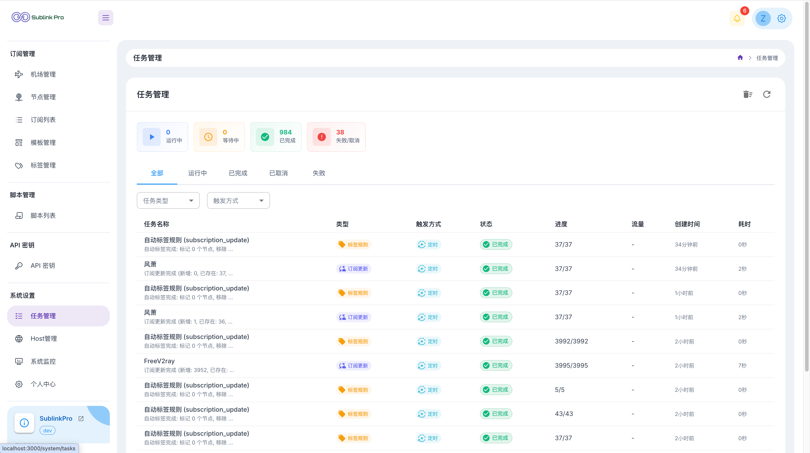 |
| 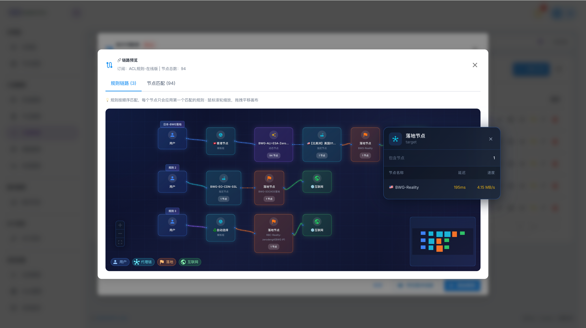 | 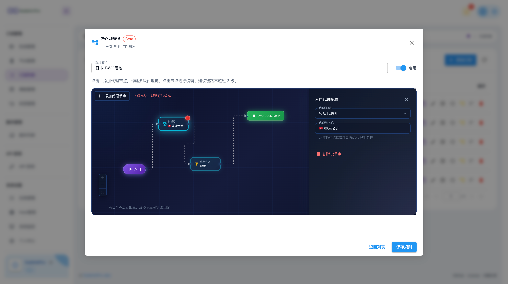 |

</details>

---

## 📊 项目统计

<div align="center">

[//]: # (  )
  
  
</div>

---

## 🤝 贡献与支持

如果这个项目对您有帮助，欢迎：

- ⭐ **Star** 这个项目表示支持
- 🐛 提交 [Issue](https://github.com/ZeroDeng01/sublinkPro/issues) 反馈问题或建议
- 🔧 提交 Pull Request 贡献代码
- 📖 完善文档和使用教程

### 🙏 致谢

感谢以下项目的开源贡献：

- [sublinkX](https://github.com/gooaclok819/sublinkX) / [sublinkE](https://github.com/eun1e/sublinkE) - 原始项目
- [Berry Free React Admin Template](https://github.com/codedthemes/berry-free-react-admin-template) - 前端模板
- [Mihomo](https://github.com/MetaCubeX/mihomo) - 代理核心

---

<div align="center">
  <sub>Made with ❤️ by <a href="https://github.com/ZeroDeng01">ZeroDeng01</a></sub>
</div>
